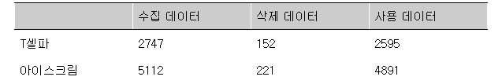
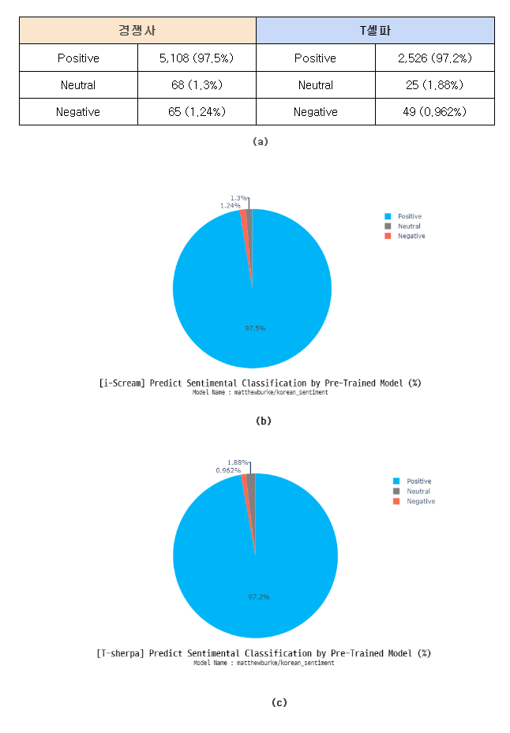
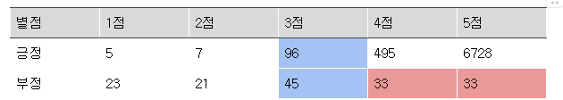
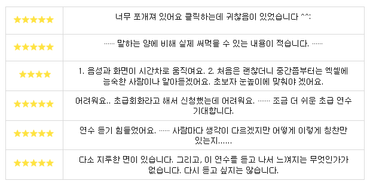
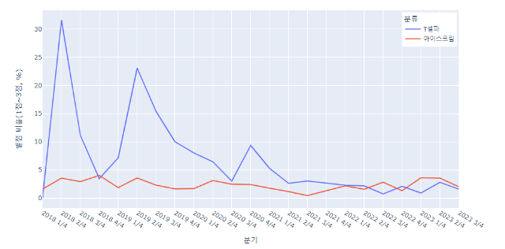
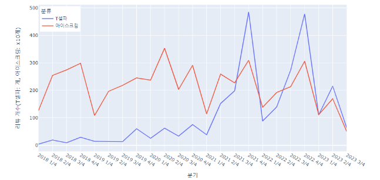

<h1 align="center"> 
    
  연수후기 비교분석
</h1>

<h3 align="center">
</h3>  

   
  프로젝트 기반 빅데이터 서비스 개발자 양성 과정 4기  
   박준식⠂이찬녕⠂이형석⠂임유하 

    

## Abstract
이 연구에서는 온라인 원격연수 사이트의 후기 데이터를 통해 사용자들의 반응을
검토하여 원격연수의 효과적인 방향을 제시하고자 한다.
원격교육 연수 사이트인 ‘T셀파’와 경쟁사에서 2018년부터 2023년까지의
원격연수후기 데이터를 수집하고, 감정 분석을 용이하게 하기 위해 T셀파 사용 데이터
2595개, 경쟁사 사용 데이터 4891개로 분석하였다.
분석 결과 같은 평점이더라도 서로 다른 반응을 나타내는 후기와 비교적 높은 평점이라도
부정적인 반응을 나타내는 후기가 존재하였다.
감정 분석한 데이터를 워드 클라우드로 작성한 결과 긍정과 부정을 나타내는 단어의
빈도수를 확인할 수 있었다.

<b>주제어 : 원격연수, 감정 분석, 워드클라우드</b>

 

## Introduction
교원대상의 원격연수는 ‘연수학점제 및 원격연수원 설치 기본계획(2000. 2. 18 개정)’에
의거하여 도입되었다(황재연, 최명숙, 2006). 온라인을 통한 연수는 오프라인에 비해
시간과 공간 제약이 적으며, 교육비의 절감 및 반복적인 학습이 가능하다는 장점을 지니고
있다.
인터넷 및 컴퓨터의 발달로 연수자의 편의성을 높인 스마트 디바이스 기반의 모바일
연수과정이 가능하게 되었고, 이를 통해 수동적인 연수 참여 및 부족한 교육시간 확보
등의 문제를 해결하고자 하였다(이동원, 강성구, 2014). 이와 같은 연수방법으로 온라인
원격연수는 접근성을 높일 수 있었고 다양한 콘텐츠 제공 등을 통해 오프라인보다 더
보편적인 연수과정으로 자리잡았다(박광록, 허철무, 2019).
그러나 이러한 원격연수의 문제점도 또한 동시에 제기되고 있는데(정한호, 2017), 동영상
위주의 강의로 인한 상호작용의 미흡과, 연수의 질 관리 부실, 연수생 관리 소홀 등과 같은
문제점(김성호, 2003; 이선희, 2002; 장용구, 2002; 조국남,2004)이 거론되고 있다. 이로
인해 교사들의 원격연수 수강 비율이 저하될 가능성이 제기되고 있다.
온라인 원격연수의 장단점이 제시되는 가운데, 여전히 오프라인보다 온라인 원격연수를
주로 이용하는 교사들이 다수 존재한다. 교사들에게 양질의 연수를 제공하기 위한 노력이
필요한 상황이다. 따라서 온라인 원격연수 사이트의 연수후기를 분석하여 원격연수에
대한 교사들의 반응을 검토하고, 원격연수가 효과적인 방향으로 나아갈 수 있도록 도움이
되는 시사점을 도출할 필요가 있다

 

## Method
|  |
|:--:|
| <b> [Figure1] Project Workflow </b> |
| 연수원 후기 분석 프로젝트의 모든 과정을 워크플로우로 시각화하였다. |

<b>i) 데이터 수집 및 전처리</b>
 
- Python의 Selenium 패키지를 이용해 데이터를 수집한다. 후기는 2018년 1월 1일
후기부터 수집한다. T셀파 연수원 홈페이지와 경쟁사 연수원 홈페이지에서 각각
T셀파 2747개, 경쟁사 5112개의 연수 후기를 수집했다.
- T셀파의 연수 후기보다 경쟁사의 연수 후기가 더 많기 때문에 개수를 맞추기 위해
경쟁사의 연수 후기는 각 페이지당 맨 위의 1건의 후기만 수집한다.
- 연수후기는 후기의 제목과 내용을 합쳐 하나의 열에 넣은 뒤 감정 분석을 위해 512자를
넘는 후기는 삭제 처리한다. 삭제 처리 후 T셀파 2595개(152개 삭제), 경쟁사
4891개(221개 삭제)의 데이터가 남았다.

|  |
|:--:|
| <b> [Figure2] 전체 수집 데이터와 사용 데이터 수 </b> |
| 후기의 제목과 내용을 합쳐 512자를 넘는 후기는 삭제 처리 |
 
<b>ii) 모델링</b>
 
후기를 작성한 사람들이 선택한 별점과 Pre-Trained 모델이 분류하는 비율은 어떻게
다를지 실험했다. 별점은 3점을 중립 점수로 설정하고 별점 4,5개는 긍정, 별점 1,2개는
부정으로 나누었다. 위 그림을 보면 수집한 데이터에서 98.2%의 높은 비율로 긍정의
평가가 많다는 것을 알 수 있다.
Huggingface를 참고하여 제작자와 모델명을 적음으로써(ex. klue/bert-base) 비교적
간단히 Pre-Trained 모델을 불러왔다. 그 다음 AutoTokenizer와 AutoModelForSequenceClassification, TextClassificationPipeline으로 수집한 데이터들의 감성 분류를 진행했다.
 
 
<b>iii) 감정 분석</b>
 
같은 평점이라도 서로 다른 반응을 보이는 후기가 존재하여, 이를 감정 분석 텍스트
마이닝을 사용해 긍정적인 반응과 부정적인 반응으로 분류한다.
온라인 뉴스의 댓글 17.3GB, 약 1.8억개의 문장으로 학습된 KcELECTRA-base 모델을
기반으로 만든 korean_sentiment 모델을 이용했다. 모델이 문장을 대상으로 부여하는
0~1점의 예측 점수 중 0.5 이상을 받는 문장은 긍정적인 문장으로 분류했다.
텍스트를 문장, 구문, 토큰, 품사 등의 구성 요소로 분류한 후, 각 구문과 구성요소를
파악한다. 그리고 각 문구에 플러스(+) 또는 마이너스(-) 점수를 사용하여 감정 점수를
할당하고 점수를 종합하여 최종 감정분석을 진행한다.
 
 
<b>iv) 시각화</b>
 
감정 분석을 진행한 T셀파와 경쟁사 연수 후기 데이터를 이용해 날짜에 따른 부정
리뷰 비율과 평점 비율을 꺾은선 그래프로 시각화했다.
 
 
<b>v) 워드클라우드 분석</b>
 
T 셀파와 경쟁사 연수 후기 데이터에서 완전한 한글을 제외하고는 제거 후, 긍정
후기와 부정 후기를 각각 단어로 구분했다. 긍정 후기와 부정 후기에 공통적으로 들어가는
단어들을 불용어로 지정 후에, 남아있는 단어들을 빈도수로 정렬하여 워드클라우드로
시각화했다.
 

## Result : 수치형 데이터

|  |
|:--:|
| <b> [Figure3] 별점 기준 감정분석 </b> |
| (a) 경쟁사의 별점을 기준으로 나눈 Positive, Neutral, Negative  (b) Tsherpa의 별점을 기준으로 나눈 Positive, Neutral, Negative |

 
총 5가지 모델을 실험했는데, 그 중 가장 별점과 유사한 비율을 보여준 모델이 있었다.
첫 번째 모델은 ‘jaehyeong/koelectra-base-v3-generalized-sentiment-analysis’이다.
이 모델은 ELECTRA 학습 방식으로 34G의 한국어 text를 학습한 monologg의
KoELECTRA에 추가로 네이버 쇼핑 말뭉치와 네이버 영화 리뷰를 fine-tuning한
모델이다.
크롤링한 텍스트를 단순 KoELECTRA로 분류했을 때는 전부 중립으로 분류했으나, 리뷰
데이터를 학습한 모델이 긍정 부정을 더 잘 분류했다고 볼 수 있다.

|  |
|:--:|
| <b> [Figure4] jaehyeong 모델을 이용한 감정 분석 </b> |
| (a) jaehyeong 모델을 이용한 감정 분석 분류 표  (b) 경쟁사 Positive, Neutral, Negative 감정분석 비율  (c) T셀파 Positive, Neutral, Negative 감정 분석 비율 |

 
두 번째 모델은 ‘matthewburke/korean_sentiment’ 이다. 이 모델은 KcELECTRA 모델에
네이버 영화 리뷰를 fine-tuning 한 모델이다. KcELECTRA 모델은 첫 번째 모델의 주가
된 KoELECTRA보다 훨씬 많은 데이터를 학습한 모델에 fine-tuning한 모델이다.

|  |
|:--:|
| <b> [Figure5]  matthewburke/korean_sentiment 모델을 이용한 감정 분석 </b> |
| (a)  matthewburke/korean_sentiment 모델을 이용한 감정 분석 분류 표   (b) 경쟁사 Positive, Neutral, Negative 감정분석 비율  (c) T셀파 Positive, Neutral, Negative 감정 분석 비율 |

  
    [그림4](a) matthewburke/korean_sentiment 모델을 이용한 감정 분석 분류 표 (b) 경쟁사 Positive,
Neutral, Negative 감정 분석 비율 (c) T셀파 Positive, Neutral, Negative 감정 분석 비율

 
평점과 감정 분석을 통해 분류된 후기의 수를 표로 정리했다. 

|  |
|:--:|
| <b> [Figure6]  평점과 감정 분석을 통해 분류한 T셀파와 경쟁사의 연수 후기 </b> |
| 색이 들어간 부분은
주목해야할 부분으로 긍정과 부정이 나뉜 3점 후기와, 4,5점 임에도 부정적으로 분류된
후기들이다.
 |
 

|  |
|:--:|
| <b> [Figure7]  평점 3점 연수후기 </b> |
| 평점이 3점인 후기들은 감정분석결과 긍정과 부정 반으로 나뉘었다. |
 
평점으로만 파악하기 힘든 후기를 감정 분석을 통해 나눌 수 있다.
 

|  |
|:--:|
| <b> [Figure8]  별점 4점과 5점 중 부정적 연수 후기 </b> |
| 평점이 4점 혹은 5점이더라도 부정적인 평가내용들이 있다. |
 
 텍스트의 감정 분석을
통해 별점은 높지만 불만을 표하는 후기들을 추려낼 수 있었다. 연수원의 개선점을
파악하는데 도움이 될 것이다.
 

i) 감정 분석 부정 리뷰 비율 그래프
|  |
|:--:|
| <b> [Figure8] 감정 분석에 의한 T셀파와 경쟁사의 부정리뷰 비율 그래프 </b> |
| T셀파는 우하향 그래프를 보인다. 18년 2/4분기에는 20%에 달하는 부정 리뷰 비율을
가지다가 20년 3/4분기부터 5% 이내의 범위에서 오르내리고 있다. 경쟁사
지속적으로 0~5% 사이를 유지하고 있다.|
 

 
ii) 평점(1점~3점) 비율 그래프

|  |
|:--:|
| <b> [Figure10] T셀파와 경쟁사의 평점(1~3점) 비율 그래프 </b> |
| 부정 리뷰 비율과 비슷한 추세를 보인다. 18년 2/4분기에는 30%에 달하던 T셀파의 3점
이하 평점 비율이 21년부터는 5% 이내에서 오르내리고 있다. 경쟁사 지속적으로
0~5% 사이를 유지하고 있다.|

 
 
iii) 리뷰 개수 그래프

|  |
|:--:|
| <b> [Figure11] T셀파와 경쟁사의 분기별 리뷰 개수 그래프 </b> |
| T셀파는 서비스 시작 이후 분기 당 100건 이하의 낮은 리뷰 개수를 기록하다 21년
2분기부터 확연하게 상승했다. 아이스크림은 분기 당 1000개에서 3000여개의 후기를
기록하고 있다. 양사 공통으로 4분기에 후기 개수가 많은 것을 확인할 수 있다.|

 
 
iv) T셀파 감정 분석 워드클라우드

|  |
|:--:|
| <b> [Figure12] T셀파의 연수후기 감정 분석 워드 클라우드 긍정(좌)과 부정(우) </b> |

 
|  |
|:--:|
| <b> [Figure13] 경쟁사의 연수후기 감정 분석 워드 클라우드 긍정(좌)과 부정(우) </b> |
 
 
v) 경쟁사 감정 분석 워드클라우드

  
    [그림 10] 경쟁사 연수후기 감정 분석 워드 클라우드 긍정(좌)과 부정(우

 

## Discussion
i) T셀파는 2018년 2분기에 각각 20%, 30%에 달하던 부정적인 리뷰와 낮은 별점 비율이
점차 낮아져 5% 이내에서 오르내리고 있다(그림 6, 그림 7). 그림 8의 연수 후기 개수
그래프를 보면 2018년은 T셀파 연수원의 극초창기로 이제 막 사업이 시작된 시기이다.
그런만큼 서버나 기술적인 문제로 인한 불편으로 인해 불만이 섞인 후기가 많은 것으로
생각된다. 이러한 기술적 문제와 적은 후기, 좋지 않은 평가 때문인지 오랫동안 후기
개수가 늘지 않다가 21년도부터 분기별 후기가 100개를 넘어서기 시작했다. 그보다 조금
전부터 부정평가와 3점 이하 별점 비율이 5% 아래로 내려간 것으로 보아 문제가 개선되어
점차 사용량이 증가하기 시작한 것으로 보인다. 반면 경쟁사은은 선두주자격의 경쟁
업체로 T셀파가 사업을 시작한 시기부터 이미 자리를 잡아 놓은 상태이다. 수집이 시작된
2018년부터 이미 분기마다 수천개의 리뷰가 달리고 평가 또한 안정되어 있다.
 
 
ii) 현재 상황은 문제점을 개선하고 성장하고 있으나 점유율(후기 개수 기준)은 아직
압도적인 차이가 나는 상태로 최근까지도 분기별 후기 개수가 5배~10배까지 차이가 나고
있다. 점유율 차이를 좁히기 위해 단점은 고치고 상대의 장점은 받아들일 필요가 있는데
이를 위해 워드클라우드의 결과를 참고할 수 있을 것이다.
 
 
iii) T셀파의 부정적인 워드클라우드(그림 9)를 보면 눈에 띄는 것은 '시험'과 '구성'으로
시험 및 구성에 대한 불만이 있는 것으로 보인다. 시험의 경우에는 시험의 난이도에 대한
불만이었는데 이는 학습을 확인하는 과정이기 때문에 당장은 어쩔 수 없는 부분도 있다.
다만 이로 인한 스트레스를 최소화하기 위해 재시험에 대한 부담 완화, 힌트 제공 등의
방안을 생각해 볼 필요가 있다. 그 다음으로는 '기대'인데 여기에 '신청' 또한 "~~생각으로
신청했는데 저에게는 너무 ~~했어요"라는 식으로 기대에 어긋난 부분을 지적하는
후기이다. 이를 해결하기 위해서는 학습 내용에 대한 보다 구체적인 안내 혹은 1회차
정도를 샘플 영상으로 제공할 수 있을 것이다.
 
 
iv) 경쟁사의 긍정적인 워드클라우드(그림 10)를 보면 ‘방법’과 ‘지도’, ‘적용’이
연관되어 있는 것으로 보인다. 연수를 통해 어떤 방법을 배우고 이를 지도에 적용해 보는
것이다. 연수에 효용감을 느끼고 있음을 주목해볼 수 있다. 다음으로는 2번째로 많이
나오는 ‘필요’인데 연수가 필요해서 들었다는 내용이다. 연수의 내용이 필요할 수도
있지만 연수 수료 자체가 필요한 경우 수료가 수월한 업체를 선택하는 요인이 될 수 있다.
 
 
v) 연수 후기를 수집해 분석한 덕에 연수에 대한 평가는 자세히 알 수 있었지만 후기
개수로 실제 연수 수강량을 정확히 알 수 없다는 한계가 있다. 후기가 풍부해야
사용자들이 신뢰하고 선택할 수 있는 만큼 수강량에 비해 후기가 적다면 후기 작성을
유인할 수 있는 방법을 고려해야 한다.
 

## code
프로젝트를 수행하기 위해 만든 데이터 및 코드는 다음의 Github에서 확인할 수 있다.
 
URL : https://github.com/bigdata4th-first-line/ReviewClassification
 

## Library
pandas Python package (version 1.5.3)
 
Plotly Python package (version 5.9.0)
 
Selenium Python package (version 4.10.0)
 
KoNLPY Python package (version 0.6.0)
 
transformer Python package (version 4.24.0)
 
Word Cloud Python package (version 1.9.2)
 
Matplotlib Python package (version 3.7.0)
 

## Reference
정한호 "교원 원격연수에서 교수서비스, 비교수서비스, 지각된 품질, 만족도, 충성도 간의
구조적 관계 분석" 한국교육학연구 23.3 pp.87-115 (2017) : 87.
 
박광록, 허철무 "원격교육 서비스요인이 고객만족과 고객충성도에 미치는 영향: 취업
준비생을 중심으로" 벤처창업연구 14.4 pp.101-111 (2019) : 101.
 
이동원, 강성구 "통합교육을 위한 스마트기기 기반 원격교육연수 실태 및 만족도 분석"
통합교육연구 9.2 pp.93-112 (2014) : 93.
 
김은영, 김현진 "교원 역량 중심의 원격연수 교육과정 운영 실태 분석" 교육과정평가연구
18.1 pp.113-134 (2015) : 113.
 
안홍선, 조상식, 박현주 "원격연수 실태 및 교원의 인식 분석: 교원의 집단별 특성에 따른
연수 만족도, 참여도, 결과 활용도 분석을 중심으로" 교육문화연구 24.5 pp.215-239
(2018) : 215.
 
류근영, 이애정, 이재호.(2005).초등교사를 위한 원격연수의 질적 향상
방안.정보교육학회논문지,9(4),617-625.
 
권택환, 신재훈, 신재한 "원격연수 수강의 방해 요인 탐색과 교원 특성별 원격연수 요구의
차이 분석" 특수교육연구 17.2 pp.53-78 (2010) : 53.
 
황재연, 최명숙 "교원 원격연수에서 학습자 배경변인과 온라인 학습전략에 따른
학업성취도 및 교육만족도 분석" 교육정보미디어연구 12.2 pp.255-274 (2006) : 255.
권성연, 최경애, 박호근 "교원 특성에 따른 원격교육연수 경험 및 선호도 차이분석"
한국교원교육연구 25.2 pp.25-52 (2008) : 25.
 
이동원, 강성구 "통합교육을 위한 스마트기기 기반 원격교육연수 실태 및 만족도 분석"
통합교육연구 9.2 pp.93-112 (2014) : 93.
 
박보경, 한정혜 "초등교원 디지털·인공지능 역량 강화 연수현황 비교분석"
정보교육학회논문지 27.3 pp.303-309 (2023) : 303.
 
박창현. "누리과정 정책 수요에 대한 빅데이터 분석 : 워드클라우드와 의미망 분석을
중심으로." 유아교육연구 37.3 (2017): 73-91.
